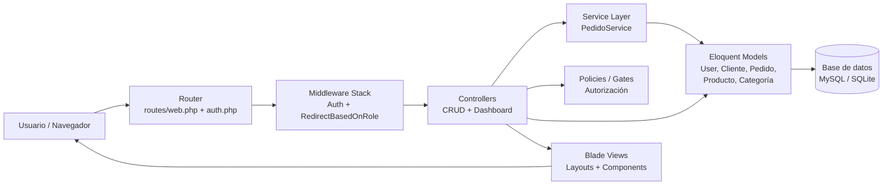
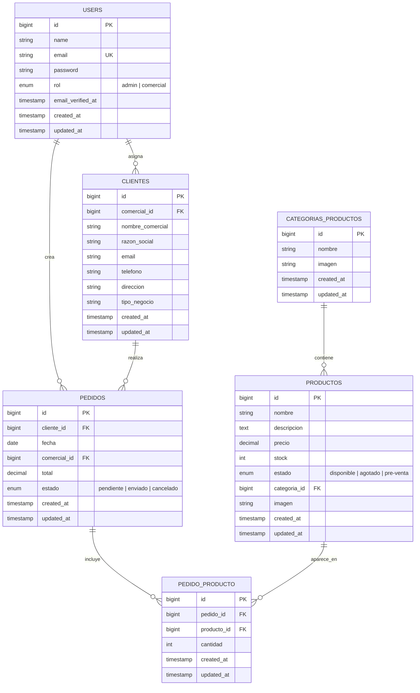
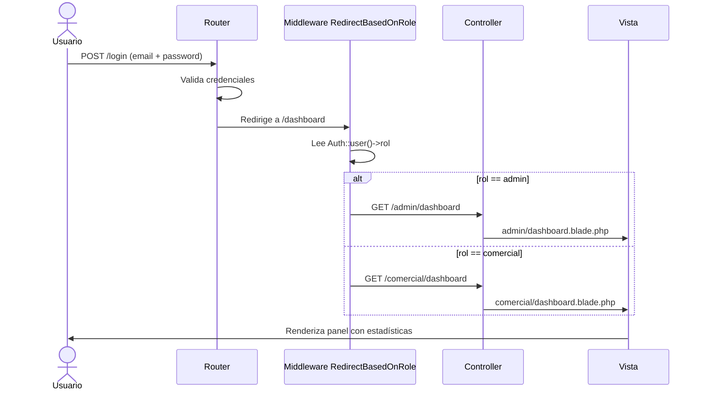
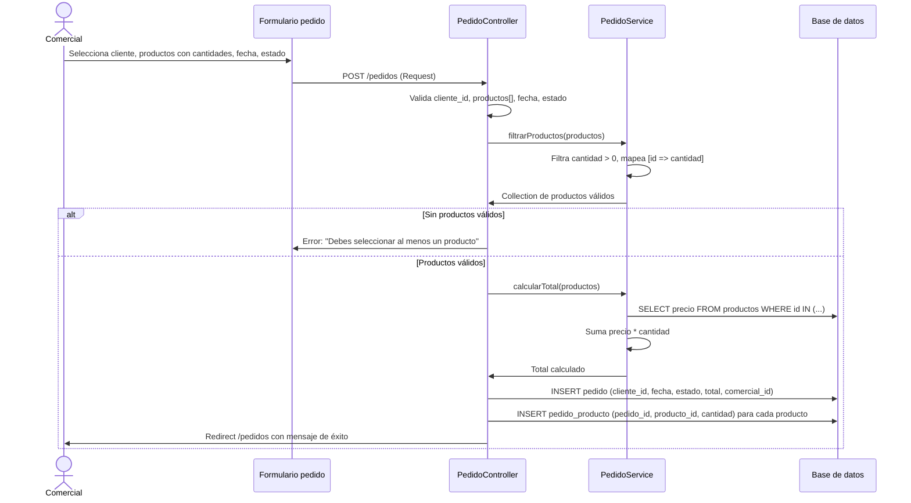
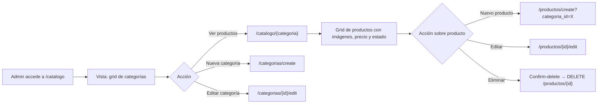

# Documentación del Proyecto Picking

Sistema de Gestión Comercial con Catálogo de Productos, Clientes y Pedidos

## Tabla de contenidos

- [1. Introducción y motivación](#1-introducción-y-motivación)
- [2. Alcance y objetivos](#2-alcance-y-objetivos)
- [3. Stack tecnológico](#3-stack-tecnológico)
- [4. Arquitectura del sistema](#4-arquitectura-del-sistema)
- [5. Modelo de datos](#5-modelo-de-datos)
- [6. Seguridad y control de acceso](#6-seguridad-y-control-de-acceso)
- [7. Diseño UI/UX](#7-diseño-uiux)
- [8. Flujos principales end-to-end](#8-flujos-principales-end-to-end)
- [9. Conclusiones y trabajo futuro](#9-conclusiones-y-trabajo-futuro)

---

## 1. Introducción y motivación

En el ámbito del comercio B2B, la gestión eficiente de catálogos de productos, clientes y pedidos constituye un pilar fundamental para cualquier empresa que opere con una red de distribuidores o comerciales. La ausencia de herramientas digitales centralizadas genera ineficiencias operativas, pérdida de trazabilidad en pedidos y dificultades para mantener un catálogo actualizado y accesible.

**Picking** surge como respuesta a esta necesidad: una aplicación web integral que permite a los equipos comerciales gestionar su cartera de clientes y pedidos, mientras que el equipo de administración mantiene el control sobre el catálogo de productos, categorías y el personal comercial. La aplicación garantiza que cada usuario acceda únicamente a las funcionalidades correspondientes a su rol, eliminando riesgos de sobrescritura o acceso no autorizado a datos sensibles.

El proyecto ha sido desarrollado con un stack moderno y profesional, aplicando patrones de arquitectura sólidos (MVC, Service Layer, Middleware personalizado) y un diseño visual coherente basado en componentes reutilizables, priorizando la usabilidad, la accesibilidad y la experiencia de usuario.

---

## 2. Alcance y objetivos

### 2.1 Objetivos generales

- Centralizar la gestión comercial (clientes, pedidos y catálogo) en una única plataforma web.
- Garantizar la seguridad mediante un sistema de autenticación con control de acceso basado en roles.
- Ofrecer una experiencia de usuario moderna, responsive y visualmente coherente.

### 2.2 Funcionalidades por rol

| Módulo | Admin | Comercial |
|---|---|---|
| **Autenticación** | Login, registro, recuperación de contraseña, verificación de email | Login, registro, recuperación de contraseña, verificación de email |
| **Dashboard** | Estadísticas globales, conteo de trabajadores, productos y categorías | Estadísticas personales, conteo de clientes y pedidos propios |
| **Clientes** | Listado completo, CRUD completo | Listado completo, CRUD completo |
| **Pedidos** | Listado completo, CRUD completo, filtros por fecha/estado | Listado completo, CRUD completo, filtros por fecha/estado |
| **Catálogo** | Visualización de categorías y productos | Visualización de categorías y productos |
| **Productos** | CRUD completo, gestión de imágenes, control de stock y estado | Solo visualización |
| **Categorías** | CRUD completo, gestión de imágenes | Solo visualización |
| **Trabajadores** | CRUD de comerciales | — |

### 2.3 Características diferenciadoras

- **Cálculo automático de totales**: al crear o editar un pedido, el sistema calcula el total en tiempo real a partir de los precios almacenados en base de datos, evitando manipulaciones manuales.
- **Asignación automática de comercial**: cuando un comercial crea un cliente o un pedido, el sistema le asigna automáticamente como responsable, liberando al usuario de operaciones repetitivas.
- **Catálogo navegable por categorías**: los productos se organizan visualmente en una cuadrícula de categorías con imágenes, facilitando la navegación y la consulta del catálogo.
- **Diseño unificado con componentes reutilizables**: más de 15 componentes Blade personalizados (`page-header`, `card`, `form-input`, `badge`, `confirm-delete`, etc.) garantizan consistencia visual y facilitan el mantenimiento.

---

## 3. Stack tecnológico

La elección del stack responde a criterios de madurez en el ecosistema, productividad del desarrollador y rendimiento en producción.

| Capa | Tecnología | Justificación |
|---|---|---|
| **Backend** | PHP 8.2 + Laravel 12 | Framework líder en PHP con arquitectura MVC sólida, ORM Eloquent potente, sistema de migraciones, middleware, policies, servicios y una comunidad extensa. |
| **Autenticación** | Laravel Breeze 2.3 | Proporciona scaffolding completo de autenticación (login, registro, recuperación, verificación de email) con Blade y TailwindCSS, ahorrando tiempo de desarrollo. |
| **Frontend** | TailwindCSS 3.x + Vite 6.x | Tailwind permite un desarrollo CSS utilitario rápido y consistente. Vite ofrece Hot Module Replacement instantáneo y builds optimizadas para producción. |
| **Interactividad** | Alpine.js 3.x | Framework ligero de JavaScript declarativo para comportamientos simples (diálogos de confirmación, toggle de menús) sin necesidad de React o Vue. |
| **Base de datos** | MySQL / SQLite | MySQL para producción (rendimiento y robustez). SQLite para desarrollo local rápido (archivo único, sin servidor adicional). |
| **Herramientas** | Composer, npm, Artisan | Estándares de facto en el ecosistema PHP/JS. Artisan automatiza tareas repetitivas (migraciones, seeders, limpieza de caché). |

---

## 4. Arquitectura del sistema

El proyecto sigue el patrón **MVC (Model-View-Controller)** de Laravel, ampliado con capas adicionales de seguridad y lógica de negocio.

### 4.1 Diagrama de arquitectura general

### 4.2 Descripción de capas

#### Router (`routes/web.php`)
Centraliza todas las rutas web del sistema. Agrupa las rutas por middleware y prefijo:
- `/catalogo` — accesible tras autenticación.
- `/comercial/*` — exclusivo para rol `comercial`.
- `/admin/*` — exclusivo para rol `admin`.
- `/clientes` y `/pedidos` — compartido entre `admin` y `comercial`.
- `/productos` y `/categorias` — exclusivo para `admin`.

#### Middleware (`RedirectBasedOnRole`)
Middleware personalizado registrado con alias `role` en `bootstrap/app.php`. Realiza dos funciones críticas:
1. **Redirección inteligente de dashboard**: la ruta `/dashboard` redirige automáticamente al panel correspondiente según el rol del usuario autenticado.
2. **Control de acceso**: recibe una lista de roles permitidos (ej. `role:admin|comercial`) y, si el usuario no pertenece a ninguno, le redirige a su dashboard propio.

#### Controllers
Siguen el patrón RESTful resource de Laravel. Destacan:
- `ClienteController`: gestiona la asignación automática del comercial logueado al crear un cliente.
- `PedidoController`: delega la lógica de filtrado de productos y cálculo de total al `PedidoService`.
- `ProductoController` / `CategoriaProductoController`: gestionan el almacenamiento de imágenes en `storage/app/public`.
- `Admin\TrabajadorController`: gestiona exclusivamente usuarios con rol `comercial`.

#### Service Layer (`PedidoService`)
Clase dedicada a la lógica de negocio de pedidos, desacoplada de los controladores:
- `filtrarProductos(array)`: filtra únicamente los productos con cantidad > 0 del formulario.
- `calcularTotal(Collection)`: consulta los precios actuales en base de datos y calcula el total evitando manipulación desde el frontend.

#### Policies (`ClientePolicy`, `PedidoPolicy`)
Definen reglas de autorización a nivel de modelo:
- Un comercial solo puede ver/editar/eliminar clientes y pedidos que él mismo creó.
- El admin tiene acceso total.

---

## 5. Modelo de datos

### 5.1 Diagrama entidad-relación

### 5.2 Relaciones Eloquent

| Modelo | Relación | Descripción |
|---|---|---|
| `User` | `hasMany(Cliente, comercial_id)` | Un comercial gestiona múltiples clientes. |
| `User` | `hasMany(Pedido, comercial_id)` | Un comercial genera múltiples pedidos. |
| `Cliente` | `belongsTo(User, comercial_id)` | Cada cliente tiene un comercial asignado. |
| `Cliente` | `hasMany(Pedido)` | Un cliente puede tener múltiples pedidos. |
| `Pedido` | `belongsTo(Cliente)` | Cada pedido pertenece a un cliente. |
| `Pedido` | `belongsTo(User, comercial_id)` | Cada pedido tiene un comercial creador. |
| `Pedido` | `belongsToMany(Producto)` con `pivot(cantidad)` | Un pedido incluye múltiples productos con cantidades. |
| `Producto` | `belongsToMany(Pedido)` con `pivot(cantidad)` | Un producto puede aparecer en múltiples pedidos. |
| `Producto` | `belongsTo(CategoriasProductos, categoria_id)` | Cada producto pertenece a una categoría. |
| `CategoriasProductos` | `hasMany(Producto, categoria_id)` | Una categoría agrupa múltiples productos. |

### 5.3 Optimización de base de datos

Se han añadido índices sobre las columnas más consultadas para mejorar el rendimiento en listados con búsqueda y filtros:

- `clientes.nombre_comercial` y `clientes.razon_social` — aceleran la búsqueda de clientes.
- `pedidos.estado` y `pedidos.fecha` — aceleran los filtros de pedidos.
- `productos.nombre` — aceleran la búsqueda en catálogo.

---

## 6. Seguridad y control de acceso

### 6.1 Autenticación

El sistema utiliza el scaffolding completo de **Laravel Breeze**, que incluye:
- Registro con verificación de email.
- Login con "Recuérdame".
- Recuperación de contraseña por email.
- Confirmación de contraseña para acciones sensibles.

Las contraseñas se almacenan hasheadas con el algoritmo bcrypt de Laravel. Los tokens de sesión y remember-me se gestionan de forma segura.

### 6.2 Control de roles

El campo `users.rol` es un `enum('admin', 'comercial')` con valor por defecto `comercial`. Este campo es la base de todo el sistema de autorización.

### 6.3 Middleware de redirección y autorización

El middleware `RedirectBasedOnRole` opera en dos modalidades:

1. **Redirección de dashboard**: cuando un usuario autenticado accede a `/dashboard`, es redirigido automáticamente a `/admin/dashboard` (si es admin) o `/comercial/dashboard` (si es comercial).
2. **Protección de rutas**: cuando una ruta especifica roles permitidos (ej. `role:admin`), los usuarios con rol distinto son redirigidos a su propio panel, evitando accesos no autorizados por URL.

### 6.4 Policies (autorización a nivel de recurso)

Se implementan **Laravel Policies** sobre `Cliente` y `Pedido`. Un comercial solo puede:
- Ver clientes y pedidos que él creó.
- Editar y eliminar sus propios registros.

El admin dispone de acceso total a todos los recursos.

---

## 7. Diseño UI/UX

### 7.1 Filosofía de diseño

El diseño busca **coherencia, claridad y eficiencia**. Cada pantalla utiliza la misma paleta de colores, los mismos componentes de entrada, los mismos patrones de navegación y los mismos estados de retroalimentación. Esto reduce la curva de aprendizaje del usuario y proyecta una imagen profesional.

### 7.2 Tokens de color y tipografía

Se define un sistema de tokens semánticos en `tailwind.config.js`:

- **Paleta corporativa (naranja)**: `brand-50` a `brand-900`, donde `brand-500` (`#f97316`) es el color primario de acción (botones principales, enlaces activos).
- **Tipografía**: Poppins como fuente principal, con pesos 300–700.
- **Bordes redondeados**: `rounded-xl` (20px) y `rounded-2xl` (16px) como estándar para inputs, tarjetas y botones.

### 7.3 Componentes reutilizables (Blade UI)

Se han creado más de 15 componentes Blade bajo `resources/views/components/ui/`:

| Componente | Uso |
|---|---|
| `page-header` | Título de página + botón de acción principal. |
| `card` | Contenedor visual para formularios, tablas y contenido. |
| `button` | Botón primario (naranja) y secundario (gris claro). |
| `form-input` | Input con label, validación, estados de error y estilos unificados. |
| `form-select` | Select con label y estilos consistentes. |
| `badge` | Etiquetas de estado con colores semánticos (verde, rojo, amarillo). |
| `alert` | Mensajes de éxito, error e información con iconos. |
| `back-link` | Enlace de retorno con flecha y hover consistente. |
| `empty-state` | Estado vacío con mensaje y CTA para crear nuevo elemento. |
| `stat-card` | Tarjeta de estadísticas con icono, valor y etiqueta. |
| `confirm-delete` | Diálogo de confirmación inline con Alpine.js. |
| `table` | Tabla con encabezado estilizado y slot de paginación. |
| `nav-item` | Elemento de navegación con estado activo e icono. |

### 7.4 Responsive y accesibilidad

- **Mobile-first**: las vistas utilizan `max-w-*` con márgenes adaptativos y grids que se reconfiguran (`grid-cols-1` → `sm:grid-cols-2` → `lg:grid-cols-4`).
- **Menú hamburguesa**: la navegación colapsa en móviles con Alpine.js.
- **Accesibilidad**: todos los inputs tienen `for`/`id` asociados, los botones tienen `aria-label`, y los colores cumplen contraste suficiente.

---

## 8. Flujos principales end-to-end

### 8.1 Autenticación y redirección al panel

### 8.2 Creación de un pedido completo

### 8.3 Gestión de productos por categoría (admin)

---

## 9. Conclusiones y trabajo futuro

### 9.1 Conclusiones

El proyecto **Picking** demuestra la aplicación de un stack moderno y profesional (Laravel 12, TailwindCSS, Vite, Alpine.js) para resolver un problema real de gestión comercial. Destacan los siguientes logros:

1. **Arquitectura sólida**: separación clara de responsabilidades entre rutas, middleware, controladores, servicios, policies y modelos.
2. **Seguridad robusta**: autenticación completa con Breeze, control de acceso por roles con middleware personalizado y autorización a nivel de recurso con policies.
3. **Experiencia de usuario coherente**: más de 15 componentes Blade reutilizables, diseño responsive, tokens de color semánticos y retroalimentación visual consistente.
4. **Optimización de base de datos**: índices estratégicos sobre columnas de búsqueda y filtrado, relaciones Eloquent bien definidas y tabla pivote para el pedido-producto.
5. **Desacoplamiento de lógica de negocio**: el `PedidoService` centraliza la lógica de cálculo, facilitando tests unitarios y el mantenimiento futuro.

### 9.2 Trabajo futuro

- **API REST**: exponer endpoints JSON para permitir integración con aplicaciones móviles o ERPs externos.
- **Exportación de datos**: generación de PDFs de pedidos y exportación a Excel de clientes y pedidos.
- **Notificaciones en tiempo real**: alertas por email o dashboard cuando un pedido cambia de estado.
- **Estadísticas avanzadas**: gráficos de evolución de ventas, productos más vendidos y rentabilidad por comercial.
- **Tests automatizados**: ampliar la suite de tests con Feature Tests para los controladores y Unit Tests para el `PedidoService`.
- **Multitenancy**: permitir que múltiples empresas utilicen la misma instalación con datos completamente aislados.
