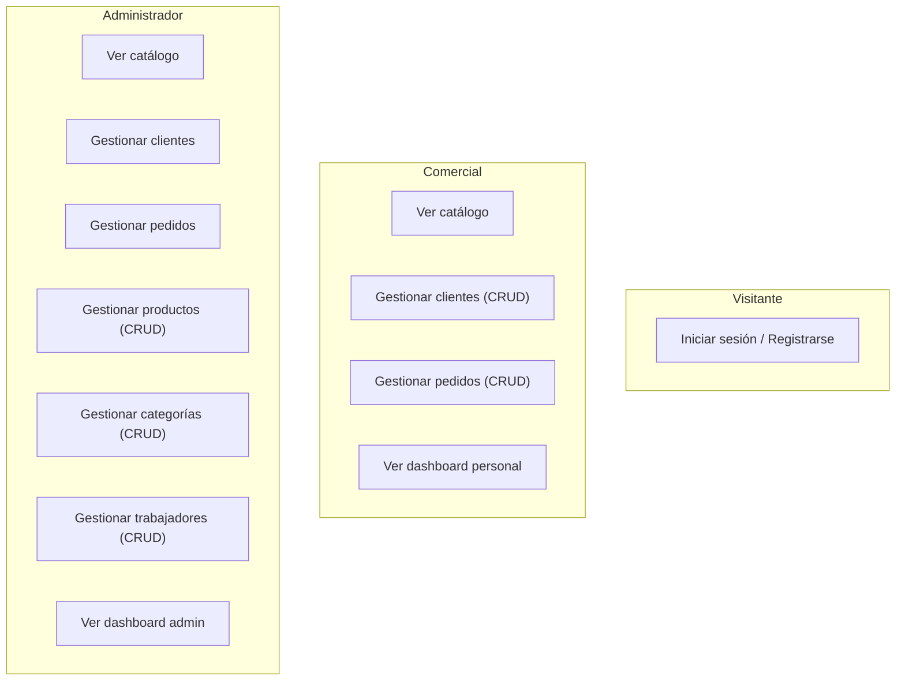
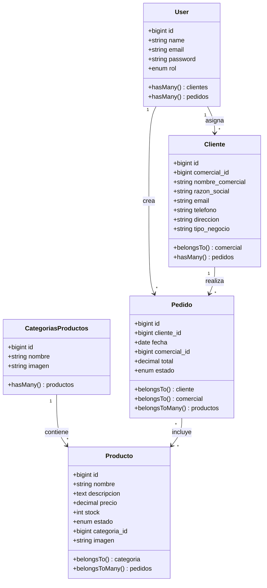
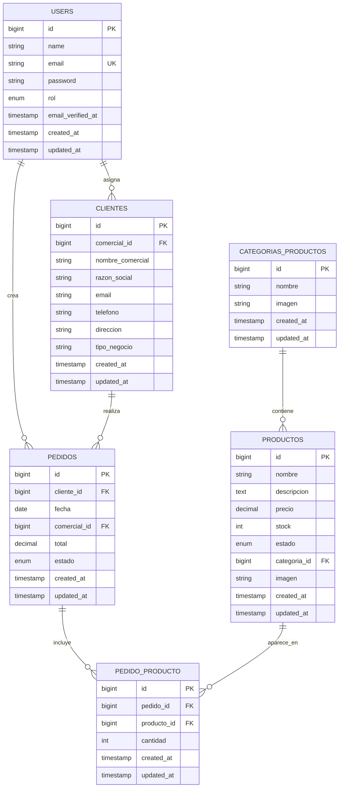
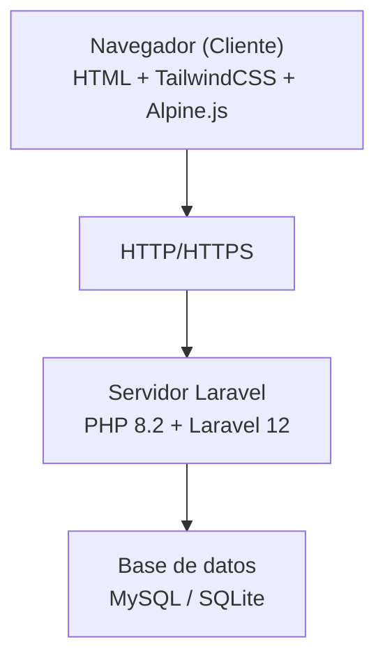

# PROYECTO FINAL — Picking

Sistema de Gestión Comercial con Catálogo de Productos, Clientes y Pedidos

---

## Contenido

1. [INTRODUCCIÓN](#1-introducción)
2. [ANÁLISIS DEL SISTEMA](#2-análisis-del-sistema)
3. [DISEÑO DEL SISTEMA](#3-diseño-del-sistema)
4. [IMPLEMENTACIÓN](#4-implementación)
5. [PRUEBAS DE SOFTWARE](#5-pruebas-de-software)
6. [CONCLUSIONES](#6-conclusiones)
7. [BIBLIOGRAFÍA Y REFERENCIAS](#7-bibliografía-y-referencias)
8. [ANEXO 1: MANUAL DE INSTALACIÓN](#8-anexo-1-manual-de-instalación)
9. [ANEXO 2: MANUAL DE USUARIO](#9-anexo-2-manual-de-usuario)

---

## 1. INTRODUCCIÓN

### 1.1. Introducción del proyecto

El proyecto consiste en el desarrollo de una aplicación web de gestión comercial utilizando **Laravel 12**, un framework de PHP que permite crear aplicaciones web seguras, escalables y mantenibles. La necesidad de este proyecto surge de la creciente demanda de herramientas digitales que faciliten la gestión de carteras de clientes, pedidos y catálogos de productos para empresas con equipos comerciales, optimizando la trazabilidad de pedidos y ofreciendo una experiencia de usuario moderna y eficiente.

Entre las principales ventajas destacan la centralización de la gestión comercial, la automatización del cálculo de pedidos, la seguridad en el acceso mediante control de roles, la facilidad de mantenimiento y la capacidad de ampliación del sistema. Así, este proyecto no solo proporciona una herramienta práctica para la gestión comercial, sino que también permite aplicar conocimientos avanzados de desarrollo web y buenas prácticas profesionales.

### 1.2. Propósito

**Picking** es una aplicación web que permite gestionar un catálogo de productos, clientes y pedidos, desarrollada con Laravel, que diferencia entre administrador y comercial.

La página principal muestra el formulario de inicio de sesión. Tras autenticarse, el sistema redirige automáticamente al panel correspondiente según el rol del usuario.

El panel de **administrador** incluye:
- Dashboard con estadísticas globales (clientes, pedidos, productos, categorías y trabajadores).
- Gestión completa de productos (CRUD con imágenes, stock y estado).
- Gestión completa de categorías (CRUD con imágenes).
- Gestión de trabajadores (creación de comerciales).
- Visualización del catálogo por categorías.
- Acceso compartido a clientes y pedidos.

El panel de **comercial** incluye:
- Dashboard personal con estadísticas de clientes y pedidos propios.
- Gestión de clientes (CRUD completo).
- Gestión de pedidos (CRUD completo con cálculo automático de totales).
- Visualización del catálogo por categorías.

Al crear un pedido, el comercial selecciona un cliente, elige productos organizados por categorías con cantidades, define fecha de entrega y estado, y el sistema calcula automáticamente el total a partir de los precios reales almacenados en base de datos, evitando manipulaciones desde el frontend. Los productos pueden tener estados: disponible, agotado o pre-venta.

El sistema utiliza **Laravel Policies** para garantizar que un comercial solo pueda ver, editar o eliminar sus propios clientes y pedidos, mientras que el administrador tiene acceso total.

### 1.3. Objetivos del proyecto

- Realizar un estudio de los requisitos necesarios para el desarrollo del sistema de gestión comercial, identificando funcionalidades, roles de usuario y necesidades del negocio.
- Desarrollar una aplicación web que permita a los comerciales gestionar clientes y pedidos de manera segura, con cálculo automático de totales y control de estados.
- Desarrollar una interfaz de uso sencilla e intuitiva, que facilite la navegación entre el catálogo, los paneles de administración y comercial. Tendrá un diseño moderno con paleta corporativa naranja.
- Redactar los manuales de usuario e instalación, proporcionando instrucciones claras para la utilización de la aplicación y su correcta configuración.
- Redactar la memoria del proyecto, incluyendo justificación, objetivos, características, metodología utilizada y conclusiones del desarrollo.
- Crear una base de datos relacional con las tablas necesarias (usuarios, clientes, pedidos, productos, categorías y tabla pivote pedido-producto).
- Implementar un sistema de roles (admin/comercial) con middleware personalizado y policies de autorización.
- Adaptar la página web a diferentes dispositivos como ordenador, móvil y tablet (diseño responsive).
- Lograr las expectativas del propietario de la aplicación, ya que es una parte importante y fundamental de este proyecto.
- Pasar a producción la aplicación web para que pueda estar disponible a los usuarios.

Una vez finalizado el proyecto, se realizará un análisis para comprobar qué objetivos se han alcanzado y cuáles no. En caso de no alcanzarse alguno, se estudiará el motivo y, en caso de ser necesario, se tomarán de referencias para futuras mejoras.

### 1.4. Coste del proyecto

#### 1.4.1. Costes de Desarrollo

**Costes Recursos Informáticos:**

- **Hardware** — Ordenador de desarrollo y periféricos: PC o portátil utilizado para programar, ejecutar Laravel, base de datos y pruebas locales (entre 700 y 1000 €). Ratón, teclado, auriculares, disco externo de copias de seguridad (entre 100 y 150 €).
- **Software** — Todas las herramientas utilizadas en el proyecto son gratuitas o de código abierto:
  - Laravel 12: Framework PHP para el desarrollo del backend.
  - Visual Studio Code: Editor de código principal.
  - Composer: Gestión de dependencias PHP.
  - MySQL / SQLite: Base de datos utilizada.
  - PHP 8.2: Lenguaje de programación.
  - Git / GitHub: Control de versiones.
  - Navegadores de prueba: Chrome, Edge, Firefox.
- **Hosting y dominio**: Alojamiento web, registro del dominio y certificado SSL (entre 50–180 €).

Total aproximado (primer año): **1.330 €**.

**Costes de personal:**

El desarrollo del proyecto ha sido realizado íntegramente por el estudiante, por lo que no existe coste económico asociado a mano de obra, pero en un entorno profesional, este proyecto sería desarrollado por un programador web con conocimientos en Laravel, PHP, HTML, CSS, JavaScript, TailwindCSS y MySQL.

Horas estimadas por fase:

| Fase | Horas estimadas |
|---|---|
| Análisis de requisitos | 10–15 h |
| Diseño de la arquitectura y base de datos | 8–12 h |
| Backend (CRUD, controladores, modelos, roles, middleware, policies, services) | 40–55 h |
| Frontend (vistas Blade, TailwindCSS, componentes UI, responsive) | 25–35 h |
| Refactorización UI/UX (tokens de color, componentes reutilizables) | 15–20 h |
| Validaciones e integración | 10–15 h |
| Pruebas y depuración | 10–15 h |
| Documentación | 10–15 h |
| **Total** | **128–182 horas** |

Coste Desarrollador: 30 €/h  
**Total: Entre 3.840 € y 5.460 €**.

#### 1.4.2. Costes de Implantación

El coste de implantación corresponde al trabajo necesario para poner en funcionamiento la aplicación en un entorno real de producción. Incluye la configuración del servidor, implementación del código, ajustes de seguridad, base de datos, pruebas finales, puesta en marcha y mantenimiento.

En un entorno profesional, estas tareas las realiza un técnico DevOps o desarrollador especializado en implementación, con un coste por hora entre 25 y 45 €/hora.

| Tarea | Tiempo estimado | Coste aprox. |
|---|---|---|
| Configuración del servidor (PHP, Composer, MySQL, Apache/Nginx, permisos) | 2–3 h | 60–135 € |
| Despliegue del proyecto (Git, composer install, .env, APP_KEY, optimización) | 1,5–2 h | 45–90 € |
| Configuración de base de datos | 1–1,5 h | 30–67,5 € |
| Configuración de dominio y certificado SSL | 0,5–1 h | 15–45 € |
| Pruebas finales funcionales | 1,5–2 h | 45–90 € |
| **Total implantación inicial** | **6,5–9,5 h** | **195–427,5 €** |
| Mantenimiento mensual | 1–2 h/mes | 30–90 €/mes |

---

## 2. ANÁLISIS DEL SISTEMA

### 2.1. Introducción

**Análisis:**  
En esta fase se identifican las necesidades del proyecto y se definen los requisitos funcionales y no funcionales del sistema de gestión comercial. Se estudia qué funcionalidades deben estar disponibles para administrador y comercial, como la gestión de clientes, pedidos, productos y categorías. También se analizan aspectos de seguridad, rendimiento y escalabilidad necesarios para garantizar una experiencia de usuario eficiente y segura.

**Diseño:**  
Se desarrolla la estructura de la aplicación, incluyendo la arquitectura MVC (Modelo–Vista–Controlador) de Laravel. Se definen las rutas, controladores, modelos y vistas, así como la base de datos que almacenará los usuarios, clientes, pedidos, productos y categorías. Además, se diseña la interfaz de usuario de forma intuitiva, incluyendo dashboards, catálogo, formularios CRUD y listados con paginación. Se crean diagramas de flujo y esquemas de navegación para planificar la interacción del usuario.

**Implementación o Codificación:**  
Se lleva a cabo la programación de la aplicación usando Laravel y PHP, desarrollando todas las funcionalidades definidas: autenticación de usuarios con roles, catálogo de productos por categorías, gestión de clientes y pedidos con cálculo automático de totales, dashboards personalizados y gestión de productos/categorías (admin). Se integran las bases de datos, se implementan formularios y validaciones, y se aplican estilos con TailwindCSS, componentes Blade reutilizables y Alpine.js para mejorar la experiencia de usuario.

**Prueba:**  
Se realizan pruebas de funcionalidad, usabilidad y seguridad para verificar que todas las partes de la aplicación funcionan correctamente. Esto incluye pruebas del catálogo, CRUD de clientes, creación de pedidos, dashboards, control de acceso por roles y gestión de productos/categorías. Se corrigen incidencias detectadas y se optimiza el rendimiento para su correcto funcionamiento en distintos dispositivos.

### 2.2. Análisis de requisitos

El proyecto tiene como objetivo desarrollar un sistema de gestión comercial que permita a los equipos comerciales gestionar clientes y pedidos de manera segura y eficiente, y al equipo de administración mantener el control sobre el catálogo de productos, categorías y personal comercial.

**1. Propiedades que deben satisfacer:**

- **Funcionalidad**: La aplicación debe permitir la gestión de clientes, creación de pedidos con cálculo automático de totales, visualización de catálogo por categorías, y gestión de productos/categorías (admin).
- **Usabilidad**: La interfaz debe ser clara, intuitiva y fácil de navegar para todo tipo de usuario.
- **Seguridad**: Proteger los datos de los usuarios y restringir el acceso según el rol asignado.
- **Fiabilidad**: La aplicación debe funcionar de manera consistente sin errores y permitir recuperar la información correctamente.
- **Escalabilidad**: Debe ser posible añadir nuevas funcionalidades o productos sin afectar al rendimiento general.

**2. Restricciones:**

- **Tecnológicas**: La aplicación se desarrollará exclusivamente con Laravel (PHP) y tecnologías web asociadas (HTML, CSS, TailwindCSS, JavaScript, Alpine.js, bases de datos).
- **Usuarios**: Existen roles de administrador y comercial.
- **Recursos**: Limitación a recursos disponibles para desarrollo, hosting y almacenamiento.
- **Tiempo**: El proyecto debe completarse dentro del plazo establecido.
- **Compatibilidad**: La aplicación debe ser accesible desde dispositivos con navegador web moderno, tanto en escritorio como en móviles.

#### 2.2.1. Requisitos Funcionales

**Autenticación de usuarios:**

- Permitir registro, inicio de sesión y cierre de sesión de usuarios.
- Diferenciar entre administrador y comercial para ofrecer funcionalidades diferenciadas.
- Recuperación de contraseña por email.

**Gestión del catálogo de productos:**

- Mostrar todas las categorías disponibles con imagen y nombre.
- Mostrar productos por categoría con información básica (nombre, precio, estado, imagen).
- Todos los usuarios autenticados pueden visualizar el catálogo.

**Gestión de clientes (comercial + admin):**

- Listado de clientes con búsqueda por nombre comercial, razón social o ID.
- CRUD completo de clientes (crear, leer, actualizar, eliminar).
- Asignación automática del comercial logueado al crear un cliente.
- Paginación de resultados.

**Gestión de pedidos (comercial + admin):**

- Listado de pedidos con filtros por cliente, fecha y estado.
- CRUD completo de pedidos.
- Selección de productos organizados por categorías con cantidades.
- Cálculo automático del total a partir de precios de base de datos.
- Estados del pedido: pendiente, enviado, cancelado.

**Panel de administración:**

- Dashboard con estadísticas globales.
- Gestión de trabajadores (creación de comerciales).
- Gestión completa de productos (CRUD con imágenes).
- Gestión completa de categorías (CRUD con imágenes).

**Seguridad de la aplicación:**

- Validar datos de usuario y formularios antes de enviarlos a la base de datos.
- Proteger la información mediante autenticación segura y policies de autorización.
- Middleware de control de acceso por roles.

#### 2.2.2. Requisitos No Funcionales

**Rendimiento:**

- La aplicación debe cargar las páginas principales en menos de 3 segundos bajo condiciones normales de uso.

**Usabilidad:**

- La interfaz debe ser intuitiva, clara y fácil de usar, permitiendo que cualquier usuario pueda navegar sin dificultad.

**Seguridad:**

- Proteger la información personal de los usuarios y los datos del negocio.
- Implementar autenticación segura y validación de datos en formularios.
- Uso de policies para control de acceso a nivel de recurso.

**Disponibilidad:**

- La aplicación debe estar disponible 24/7 para los usuarios, siempre que haya acceso a Internet.

**Compatibilidad:**

- La aplicación debe funcionar correctamente en los principales navegadores web (Chrome, Firefox, Edge) y ser accesible desde dispositivos móviles y de escritorio.

**Escalabilidad:**

- Permitir añadir nuevos productos, categorías y usuarios sin afectar el rendimiento general del sistema.

**Mantenibilidad:**

- El código debe estar organizado, documentado y seguir buenas prácticas para facilitar futuras modificaciones.
- Uso de componentes Blade reutilizables para consistencia visual.

**Fiabilidad:**

- La aplicación debe manejar correctamente errores y excepciones, asegurando que los datos no se pierdan y que la funcionalidad principal siempre esté disponible.

### 2.3. Casos de Uso: Diagramas y narrativas



#### Casos de uso del comercial

**Caso de Uso 1: Registrar / Iniciar sesión**

- **Actor principal**: Visitante.
- **Descripción**: Permite a un visitante crear una cuenta o iniciar sesión para acceder al sistema.
- **Condiciones de entrada**: Para registrarse, no debe existir previamente una cuenta asociada a su correo. Para iniciar sesión, debe estar registrado.
- **Flujo básico (Registrar)**: El visitante selecciona "Registrar", introduce nombre, correo y contraseña, el sistema valida los datos y crea la cuenta.
- **Flujo básico (Iniciar sesión)**: El visitante introduce correo y contraseña, el sistema valida las credenciales y inicia la sesión.
- **Flujo alternativo**: Email existente → mensaje de error. Credenciales incorrectas → mensaje de error.
- **Condiciones de salida**: El usuario queda autenticado y redirigido a su panel.

**Caso de Uso 2: Ver catálogo**

- **Actor principal**: Usuario autenticado.
- **Descripción**: Permite consultar las categorías de productos y navegar por los productos de cada categoría.
- **Flujo básico**: El usuario accede a /catalogo, visualiza la cuadrícula de categorías y pulsa una para ver sus productos.

**Caso de Uso 3: Gestionar clientes**

- **Actor principal**: Comercial / Admin.
- **Descripción**: Permite crear, visualizar, editar y eliminar clientes de la cartera.
- **Condiciones de entrada**: El usuario debe estar autenticado.
- **Flujo básico**: Accede a /clientes, visualiza el listado, puede crear nuevo cliente, editar existente o eliminar con confirmación. El comercial solo ve sus propios clientes.
- **Flujo alternativo**: Un comercial intenta ver/editar un cliente ajeno → acceso denegado por policy.

**Caso de Uso 4: Crear pedido**

- **Actor principal**: Comercial / Admin.
- **Descripción**: Permite crear un pedido seleccionando cliente, productos por categoría con cantidades, fecha de entrega y estado.
- **Flujo básico**: Accede a /pedidos/create, selecciona cliente, elige productos con cantidades > 0, define fecha y estado, sistema calcula total automáticamente, guarda el pedido y redirige al listado.
- **Flujo alternativo**: No selecciona productos con cantidad > 0 → error "Debes seleccionar al menos un producto".

**Caso de Uso 5: Ver / Editar / Eliminar pedido**

- **Actor principal**: Comercial / Admin.
- **Descripción**: Permite visualizar detalles de un pedido, editarlo o eliminarlo.
- **Condiciones de entrada**: El pedido debe existir y el comercial debe ser su creador (o ser admin).
- **Flujo básico**: Desde /pedidos pulsa "Ver" para detalles, "Editar" para modificar, o confirma eliminación.

#### Casos de uso del administrador

**Caso de Uso 6: Gestionar productos**

- **Actor principal**: Admin.
- **Descripción**: Permite crear, visualizar, editar y eliminar productos del catálogo.
- **Flujo básico**: Accede a /productos o al catálogo, crea nuevo producto con nombre, descripción, precio, stock, estado, categoría e imagen. Puede editar o eliminar existentes.
- **Flujo alternativo**: Datos inválidos → validación muestra errores. Usuario sin permisos → redirección a su dashboard.

**Caso de Uso 7: Gestionar categorías**

- **Actor principal**: Admin.
- **Descripción**: Permite crear, editar y eliminar categorías de productos.
- **Flujo básico**: Accede al catálogo, pulsa "Nueva Categoría", introduce nombre e imagen, guarda.

**Caso de Uso 8: Gestionar trabajadores**

- **Actor principal**: Admin.
- **Descripción**: Permite crear comerciales (usuarios con rol comercial).
- **Flujo básico**: Accede a /admin/trabajadores, pulsa "Nuevo Comercial", introduce nombre y email, guarda.

### 2.4. Planificación de riesgos e incidencias

Durante el desarrollo y operación del sistema se han identificado los siguientes riesgos potenciales, junto con las medidas de mitigación aplicadas:

| Riesgo | Probabilidad | Impacto | Medida de mitigación |
|---|---|---|---|
| Pérdida de datos de clientes o pedidos | Baja | Alto | Copias de seguridad periódicas de la base de datos; uso de migraciones de Laravel para reconstruir el esquema. |
| Acceso no autorizado a datos sensibles | Baja | Alto | Sistema de autenticación con Laravel Breeze, hash de contraseñas mediante bcrypt, middleware de control de roles (`RedirectBasedOnRole`) y policies de autorización a nivel de recurso (`ClientePolicy`, `PedidoPolicy`). |
| Errores en el cálculo de totales de pedidos | Baja | Medio | Lógica de negocio desacoplada en `PedidoService`, que calcula el total a partir de precios reales de base de datos, evitando manipulaciones desde el frontend. |
| Caída del servidor o indisponibilidad | Media | Alto | Desarrollo en entorno local con XAMPP; para producción se recomienda hosting con redundancia y certificado SSL. |
| Subida de archivos maliciosos | Baja | Medio | Validación de tipos MIME y extensión en formularios de imagen (`image|mimes:jpg,jpeg,png,gif,webp|max:2048`). |
| Conflictos en versiones del código | Media | Bajo | Control de versiones con Git y repositorio remoto en GitHub. |

**Registro de incidencias:**

Durante el desarrollo se llevaron a cabo pruebas manuales iterativas de caja blanca y caja negra que permitieron identificar y corregir incidencias antes de la entrega. Los resultados se documentaron mediante una tabla de casos de prueba con identificadores (CB01–CB18), entradas, acciones y resultados esperados. Esta metodología de seguimiento aseguró que los errores detectados fueron registrados, analizados y resueltos de forma sistemática.

---

## 3. DISEÑO DEL SISTEMA

### 3.1. Introducción

La aplicación está organizada de la siguiente manera:

**Arquitectura MVC (Modelo – Vista – Controlador) de Laravel.**

- **Modelo**: gestiona datos y relaciones (User, Cliente, Pedido, Producto, CategoriasProductos).
- **Vista**: plantillas Blade para mostrar el contenido al usuario, con componentes UI reutilizables.
- **Controlador**: recibe peticiones, ejecuta lógica y envía datos a las vistas.

```
Usuario → Rutas → Middleware → Controladores → Modelos → Base de datos
                                      ↓
                                  Vistas Blade
```

El objetivo del diseño es transformar los requisitos del sistema en una estructura clara de componentes, datos e interfaces. Para ello, el diseño se organiza en tres bloques principales:

- **Diagrama de clases**: representa las entidades del sistema y las relaciones entre ellas.
- **Diseño de la base de datos**: describe cómo se almacenan los datos en una base de datos relacional.
- **Diseño de la interfaz**: define la apariencia general de la aplicación web, la organización de las pantallas y los elementos de interacción.

### 3.2. Diagrama de Clases

El diagrama de clases describe la estructura del sistema mostrando sus clases, atributos y las relaciones entre ellas.

| Clase | Atributos principales | Relaciones |
|---|---|---|
| **User** | id, name, email, password, rol | hasMany(Cliente), hasMany(Pedido) |
| **Cliente** | id, comercial_id, nombre_comercial, razon_social, email, telefono, direccion, tipo_negocio | belongsTo(User), hasMany(Pedido) |
| **Pedido** | id, cliente_id, fecha, comercial_id, total, estado | belongsTo(Cliente), belongsTo(User), belongsToMany(Producto) |
| **Producto** | id, nombre, descripcion, precio, stock, estado, categoria_id, imagen | belongsTo(CategoriasProductos), belongsToMany(Pedido) |
| **CategoriasProductos** | id, nombre, imagen | hasMany(Producto) |



### 3.3. Diseño de la Base de Datos

La base de datos relacional está compuesta por las siguientes entidades principales: usuarios, clientes, pedidos, productos, categorías de productos y la tabla pivote pedido-producto. Las migraciones de Laravel definen tipos de datos, claves primarias, claves foráneas y restricciones de integridad.

#### 3.3.1. Diseño Lógico

**Entidad: USERS**

| Atributo | Tipo | Descripción |
|---|---|---|
| id | BIGINT UNSIGNED PK, AUTO_INCREMENT | Identificador único |
| name | VARCHAR(255) | Nombre del usuario |
| email | VARCHAR(255) UK | Correo único |
| password | VARCHAR(255) | Hash de contraseña (bcrypt) |
| rol | ENUM('admin','comercial') | Rol del usuario |
| email_verified_at | TIMESTAMP NULLABLE | Verificación de email |
| remember_token | VARCHAR(100) | Token de sesión persistente |
| created_at / updated_at | TIMESTAMP | Fechas de creación y modificación |

**Entidad: CLIENTES**

| Atributo | Tipo | Descripción |
|---|---|---|
| id | BIGINT UNSIGNED PK, AUTO_INCREMENT | Identificador único |
| comercial_id | BIGINT UNSIGNED FK → users.id | Comercial asignado |
| nombre_comercial | VARCHAR(255) | Nombre comercial del cliente |
| razon_social | VARCHAR(255) | Razón social |
| email | VARCHAR(255) NULLABLE | Email del cliente |
| telefono | VARCHAR(9) NULLABLE | Teléfono |
| direccion | VARCHAR(255) NULLABLE | Dirección |
| tipo_negocio | VARCHAR(255) NULLABLE | Tipo de negocio |
| created_at / updated_at | TIMESTAMP | Fechas de creación y modificación |

**Entidad: PEDIDOS**

| Atributo | Tipo | Descripción |
|---|---|---|
| id | BIGINT UNSIGNED PK, AUTO_INCREMENT | Identificador único |
| cliente_id | BIGINT UNSIGNED FK → clientes.id | Cliente del pedido |
| fecha | DATE | Fecha de entrega |
| comercial_id | BIGINT UNSIGNED FK → users.id | Comercial creador |
| total | DECIMAL(10,2) | Total calculado del pedido |
| estado | ENUM('pendiente','enviado','cancelado') | Estado del pedido |
| created_at / updated_at | TIMESTAMP | Fechas de creación y modificación |

**Entidad: PRODUCTOS**

| Atributo | Tipo | Descripción |
|---|---|---|
| id | BIGINT UNSIGNED PK, AUTO_INCREMENT | Identificador único |
| nombre | VARCHAR(255) | Nombre del producto |
| descripcion | TEXT NULLABLE | Descripción |
| precio | DECIMAL(8,2) | Precio de venta |
| stock | INT | Unidades disponibles |
| estado | ENUM('disponible','agotado','pre-venta') | Estado del producto |
| categoria_id | BIGINT UNSIGNED FK → categorias_productos.id | Categoría |
| imagen | VARCHAR(255) NULLABLE | Ruta de la imagen |
| created_at / updated_at | TIMESTAMP | Fechas de creación y modificación |

**Entidad: CATEGORIAS_PRODUCTOS**

| Atributo | Tipo | Descripción |
|---|---|---|
| id | BIGINT UNSIGNED PK, AUTO_INCREMENT | Identificador único |
| nombre | VARCHAR(255) | Nombre de la categoría |
| imagen | VARCHAR(255) NULLABLE | Ruta de la imagen |
| created_at / updated_at | TIMESTAMP | Fechas de creación y modificación |

**Tabla pivote: PEDIDO_PRODUCTO**

| Atributo | Tipo | Descripción |
|---|---|---|
| id | BIGINT UNSIGNED PK, AUTO_INCREMENT | Identificador único |
| pedido_id | BIGINT UNSIGNED FK → pedidos.id | Pedido |
| producto_id | BIGINT UNSIGNED FK → productos.id | Producto |
| cantidad | INT | Cantidad del producto en el pedido |
| created_at / updated_at | TIMESTAMP | Fechas de creación y modificación |

#### 3.3.2. Diseño Conceptual



### 3.4. Diseño de la Interfaz

#### 3.4.1. Plantilla General de la Aplicación (Layout)

El layout principal (`resources/views/layouts/app.blade.php`) define la estructura base de todas las páginas autenticadas:

- **Header**: barra de navegación superior con logo, enlaces de navegación (Dashboard, Catálogo, Clientes, Pedidos, Productos, Categorías, Trabajadores) renderizados condicionalmente según el rol, y menú desplegable de usuario con Perfil y Cerrar sesión.
- **Main**: área de contenido con `max-w-7xl mx-auto px-4 sm:px-6 lg:px-8` para centrar y limitar el ancho.
- **Footer**: no se incluye footer fijo; el contenido ocupa el viewport completo.
- **Sistema de componentes**: más de 15 componentes Blade reutilizables bajo `components/ui/` garantizan consistencia visual (page-header, card, button, form-input, form-select, badge, alert, back-link, empty-state, stat-card, confirm-delete, table, nav-item).

La tipografía principal es **Poppins** (pesos 300–700), definida en `tailwind.config.js`. La paleta corporativa es naranja (`brand-50` a `brand-900`), con `#f97316` como color primario de acción.

#### 3.4.2. Pantallas Principales del Sistema

| Pantalla | Ruta | Descripción |
|---|---|---|
| Login | `/login` | Formulario de inicio de sesión con email, contraseña y "Recuérdame". Diseño centrado con fondo orange-50. |
| Registro | `/register` | Formulario de registro con nombre, email, contraseña y confirmación. |
| Dashboard Admin | `/admin/dashboard` | Estadísticas globales: conteo de trabajadores, productos, categorías. Tarjetas de acceso rápido. |
| Dashboard Comercial | `/comercial/dashboard` | Estadísticas personales: clientes propios, pedidos propios. Tarjetas de acceso rápido. |
| Catálogo (Categorías) | `/catalogo` | Grid responsive de categorías con imagen circular o inicial del nombre. |
| Catálogo (Productos) | `/catalogo/{categoria}` | Grid de productos con imagen, nombre, precio y badge de estado. Botones de gestión para admin. |
| Clientes (Listado) | `/clientes` | Tabla paginada con búsqueda. Columnas: ID, nombre comercial, razón social, teléfono, acciones. |
| Clientes (Crear/Editar) | `/clientes/create`, `/clientes/{id}/edit` | Formulario con inputs unificados (form-input, form-select) en tarjeta centrada. |
| Clientes (Detalle) | `/clientes/{id}` | Vista de detalle con todos los campos del cliente y botones de acción. |
| Pedidos (Listado) | `/pedidos` | Tabla paginada con filtros por cliente, fecha y estado. Badges de estado. |
| Pedidos (Crear/Editar) | `/pedidos/create`, `/pedidos/{id}/edit` | Formulario con select de cliente, productos agrupados por categoría (details/summary) con inputs de cantidad, total calculado en vivo, fecha y estado. |
| Pedidos (Detalle) | `/pedidos/{id}` | Vista de detalle con cliente, productos con cantidades, total, comercial, fecha, estado. |
| Productos (Listado) | `/productos` | Tabla de productos con imagen, nombre, precio, stock, estado, categoría. |
| Productos (Crear/Editar) | `/productos/create`, `/productos/{id}/edit` | Formulario con inputs, select de categoría y estado, y campo de imagen con vista previa. |
| Categorías (Crear/Editar) | `/categorias/create`, `/categorias/{id}/edit` | Formulario con nombre e imagen, mostrando imagen actual en edición. |
| Trabajadores (Listado) | `/admin/trabajadores` | Tabla de comerciales con búsqueda y paginación. |
| Trabajadores (Crear/Editar) | `/admin/trabajadores/create`, `/admin/trabajadores/{id}/edit` | Formulario con nombre y email. |

---

## 4. IMPLEMENTACIÓN

### 4.1. Introducción

En esta fase se describe la implementación técnica del proyecto Picking, detallando la arquitectura cliente/servidor, los lenguajes de programación utilizados, las herramientas de desarrollo y la codificación de los principales módulos del sistema.

### 4.2. Arquitectura cliente/servidor

El sistema sigue el modelo **cliente-servidor** de tres capas:

1. **Capa de presentación (Cliente)**: el navegador renderiza las vistas Blade generadas por el servidor, aplicando estilos con TailwindCSS e interactividad con Alpine.js. No se utiliza un framework SPA; el servidor genera HTML completo en cada petición.
2. **Capa de lógica de negocio (Servidor)**: Laravel procesa las peticiones HTTP, aplica validaciones, ejecuta la lógica de negocio (controladores y services), gestiona la autorización (middleware y policies) y consulta la base de datos mediante Eloquent ORM.
3. **Capa de datos**: MySQL o SQLite almacenan la información, accedida exclusivamente desde el backend mediante Eloquent.



### 4.3. Lenguajes de Programación

| Lenguaje | Uso |
|---|---|
| **PHP 8.2** | Lógica de backend, controladores, modelos, middleware, policies, servicios y migraciones. |
| **HTML** | Estructura de las vistas Blade. |
| **TailwindCSS** | Estilos utilitarios para todo el frontend, con tokens de color semánticos personalizados. |
| **JavaScript (Alpine.js)** | Interactividad ligera: diálogos de confirmación, toggle de menú móvil, estados de UI. |
| **SQL** | Definición de esquema mediante migraciones de Laravel. |

### 4.4. Herramientas de Desarrollo

| Herramienta | Propósito |
|---|---|
| **Visual Studio Code** | Editor de código principal con extensiones para PHP, Blade y TailwindCSS. |
| **Composer** | Gestión de dependencias PHP (Laravel, Breeze, etc.). |
| **npm** | Gestión de dependencias JavaScript (Vite, TailwindCSS, Alpine.js). |
| **Vite** | Bundler de frontend con Hot Module Replacement para desarrollo. |
| **Git / GitHub** | Control de versiones distribuido. |
| **XAMPP / Laragon** | Entorno local con Apache, PHP y MySQL. |
| **MySQL Workbench / phpMyAdmin** | Administración visual de la base de datos. |

### 4.5. Codificación

**Estructura del backend (app/):**

- `app/Http/Controllers/`: agrupa los controladores de cada módulo.
  - `ClienteController`: CRUD de clientes con asignación automática de comercial.
  - `PedidoController`: CRUD de pedidos, delega cálculos a `PedidoService`.
  - `ProductoController`: CRUD de productos con gestión de imágenes.
  - `CategoriaProductoController`: CRUD de categorías y visualización del catálogo.
  - `Admin/DashboardController`: estadísticas del panel admin.
  - `Admin/TrabajadorController`: gestión de comerciales.
- `app/Http/Middleware/RedirectBasedOnRole.php`: middleware personalizado de control de acceso por roles.
- `app/Services/PedidoService.php`: lógica de filtrado de productos y cálculo de total desacoplada.
- `app/Policies/`: reglas de autorización a nivel de recurso (`ClientePolicy`, `PedidoPolicy`).
- `app/Models/`: modelos Eloquent con relaciones definidas.

**Estructura del frontend (resources/):**

- `resources/views/`: vistas Blade organizadas por módulo (admin/, auth/, catalogo/, categorias/, clientes/, comercial/, layouts/, pedidos/, productos/, profile/). Incluye `components/ui/` con 15+ componentes reutilizables.
- `resources/css/app.css`: importaciones de TailwindCSS (base, components, utilities).
- `resources/js/app.js`: inicialización de Alpine.js.
- `tailwind.config.js`: configuración con fuente Poppins, tokens de color `brand` y plugin de forms.

**Rutas (`routes/web.php`):**

```php
Route::get('/', fn () => view('auth.login'));
Route::get('/dashboard', fn () => view('dashboard'))->middleware(['auth', 'role']);

Route::middleware('auth')->group(function () {
    Route::get('/catalogo', [CategoriaProductoController::class, 'index'])->name('catalogo.index');
    Route::get('/catalogo/producto/{producto}', [ProductoController::class, 'showPublico'])->name('catalogo.producto');
    Route::get('/catalogo/{categoria}', [CategoriaProductoController::class, 'productos'])->name('catalogo.productos');
});

Route::middleware(['auth', 'role:comercial'])->prefix('comercial')->name('comercial.')->group(function () {
    Route::get('/dashboard', fn () => view('comercial.dashboard'))->name('dashboard');
});

Route::middleware(['auth', 'role:comercial|admin'])->group(function () {
    Route::resource('clientes', ClienteController::class);
    Route::resource('pedidos', PedidoController::class);
});

Route::middleware(['auth', 'role:admin'])->prefix('admin')->name('admin.')->group(function () {
    Route::get('/dashboard', [DashboardController::class, 'index'])->name('dashboard');
    Route::resource('trabajadores', TrabajadorController::class)->parameters(['trabajadores' => 'trabajador']);
});

Route::middleware(['auth', 'role:admin'])->resource('productos', ProductoController::class)->except(['show']);
Route::middleware(['auth', 'role:admin'])->resource('categorias', CategoriaProductoController::class)->except(['show']);
```

---

## 5. PRUEBAS DE SOFTWARE

### 5.1. Introducción

En la creación de cualquier sistema informático, la etapa de pruebas es esencial para asegurar que el producto final sea confiable, estable y cumpla con los estándares de calidad establecidos. Esta fase permite verificar que la aplicación responde a los requerimientos previamente definidos, identificar fallos antes de su implementación en un entorno real y confirmar que su funcionamiento coincide con los resultados esperados.

La aplicación sigue la arquitectura Modelo–Vista–Controlador (MVC), lo que permite una correcta separación de responsabilidades y facilita la verificación individual de cada componente.

La fase de pruebas se ha centrado en:

- Comprobación del registro e inicio de sesión de usuarios.
- Verificación del acceso restringido a rutas según el tipo de usuario.
- Validación de formularios para evitar datos incorrectos o incompletos.
- Pruebas de creación, modificación y eliminación de clientes y pedidos.
- Verificación del funcionamiento del catálogo por categorías.
- Comprobación del cálculo automático de totales en pedidos.
- Validación de las relaciones entre tablas para garantizar la integridad de los datos.
- Pruebas de policies: un comercial no puede ver/editar clientes o pedidos ajenos.

### 5.2. Técnicas de prueba

#### 5.2.1. Pruebas de Caja Blanca o Enfoque Estructural

Las pruebas de caja blanca analizan la estructura interna del software. En el caso de Picking, estas pruebas se centran en:

- **Controladores del backend**: comprobación manual de la correcta ejecución de los métodos `store`, `update`, `destroy` e `index`, así como del tratamiento adecuado de errores y redirecciones.
- **Validaciones en Laravel**: verificación de que los formularios rechazan datos incorrectos mediante las reglas de validación definidas en los controladores.
- **Middleware de autenticación y roles**: comprobación de que solo los usuarios autenticados pueden acceder a rutas protegidas y que el middleware `RedirectBasedOnRole` redirige correctamente según el rol.
- **Policies de autorización**: verificación de que un comercial solo puede acceder a sus propios clientes y pedidos, y que el admin tiene acceso total.
- **Lógica del PedidoService**: revisión del funcionamiento interno al filtrar productos con cantidad > 0 y calcular el total a partir de precios de base de datos.
- **Relaciones Eloquent**: comprobación de las relaciones entre users, clientes, pedidos, productos y categorías.

A continuación, fragmento del `PedidoController@store` que muestra la validación y delegación al service:

```php
public function store(Request $request)
{
    $data = $request->validate([
        'cliente_id' => 'required|exists:clientes,id',
        'productos'  => 'required|array',
        'productos.*.cantidad' => 'nullable|integer|min:0',
        'fecha'      => 'required|date',
        'estado'     => 'required|in:pendiente,enviado,cancelado',
    ]);

    $productosSeleccionados = $this->pedidoService->filtrarProductos($data['productos']);

    if ($productosSeleccionados->isEmpty()) {
        return back()->withErrors([
            'productos' => 'Debes seleccionar al menos un producto.'
        ])->withInput();
    }

    $total = $this->pedidoService->calcularTotal($productosSeleccionados);

    $pedido = Pedido::create([
        'cliente_id'   => $data['cliente_id'],
        'fecha'        => $data['fecha'],
        'estado'       => $data['estado'],
        'total'        => $total,
        'comercial_id' => Auth::id(),
    ]);

    $pedido->productos()->attach($productosSeleccionados->toArray());

    return redirect()->route('pedidos.index')
        ->with('success', 'Pedido creado correctamente.');
}
```

Y el `PedidoService`:

```php
class PedidoService
{
    public function filtrarProductos(array $productos): Collection
    {
        return collect($productos)
            ->filter(fn($p) => isset($p['cantidad']) && $p['cantidad'] > 0)
            ->mapWithKeys(fn($p, $id) => [
                (int)$id => ['cantidad' => $p['cantidad']]
            ]);
    }

    public function calcularTotal(Collection $productosSeleccionados): float
    {
        $productosDB = Producto::whereIn('id', $productosSeleccionados->keys())->get();
        $total = 0;
        foreach ($productosDB as $producto) {
            $cantidad = $productosSeleccionados[$producto->id]['cantidad'];
            $total += $producto->precio * $cantidad;
        }
        return $total;
    }
}
```

En este fragmento se observa la separación de responsabilidades: el controlador valida, el service calcula, y el modelo persiste. Esto demuestra la revisión estructural del flujo interno del sistema.

#### 5.2.2. Pruebas de Caja Negra o Enfoque Funcional

Las pruebas de caja negra se centran en verificar el funcionamiento del sistema desde el punto de vista del usuario, sin tener en cuenta su estructura interna.

**1. Registro e inicio de sesión de usuarios**

- Registro con datos válidos → usuario creado y sesión iniciada.
- Registro con email existente → mensaje de error.
- Login con credenciales correctas → acceso concedido.
- Login con contraseña incorrecta → mensaje de error.

**2. Control de acceso y roles**

- Usuario comercial intenta acceder a /admin/dashboard → redirección a comercial.dashboard.
- Usuario no autenticado intenta acceder a /clientes → redirección a /login.
- Comercial intenta acceder a /productos → redirección a su dashboard.

**3. Gestión de clientes**

- Crear cliente con datos válidos → almacenado correctamente.
- Crear cliente con campos obligatorios vacíos → validación muestra errores.
- Comercial ve solo sus clientes; admin ve todos.
- Comercial intenta editar cliente ajeno → acceso denegado (policy).

**4. Gestión de pedidos**

- Crear pedido con productos seleccionados → total calculado correctamente.
- Crear pedido sin productos (cantidad 0) → error "Debes seleccionar al menos un producto".
- Ver detalle de pedido → muestra cliente, productos, cantidades, total, comercial, fecha.
- Editar pedido → cambios guardados, total recalculado.

**5. Gestión de productos (admin)**

- Crear producto con imagen → almacenado correctamente.
- Crear producto sin nombre → validación muestra error.
- Eliminar producto → desaparece del catálogo.

**Tabla resumen de casos de prueba de caja negra:**

| ID | Funcionalidad | Entrada | Acción | Resultado Esperado | Estado |
|---|---|---|---|---|---|
| CB01 | Registro | Datos válidos | Enviar formulario | Usuario registrado y sesión iniciada | ✔ |
| CB02 | Registro | Email ya existente | Enviar formulario | Error por email duplicado | ✔ |
| CB03 | Login | Credenciales correctas | Iniciar sesión | Acceso concedido y redirección | ✔ |
| CB04 | Login | Contraseña incorrecta | Iniciar sesión | Mensaje de error, acceso denegado | ✔ |
| CB05 | Acceso restringido | Usuario no autenticado | Acceder a /clientes | Redirección a /login | ✔ |
| CB06 | Panel admin | Usuario comercial | Acceder a /admin/dashboard | Redirección a comercial.dashboard | ✔ |
| CB07 | Panel admin | Usuario admin | Acceder a /admin/dashboard | Acceso permitido | ✔ |
| CB08 | Crear cliente | Datos válidos | Guardar cliente | Cliente almacenado en BD | ✔ |
| CB09 | Crear cliente | Campos vacíos | Guardar cliente | Validación muestra errores | ✔ |
| CB10 | Crear pedido | Productos con cantidades | Guardar pedido | Pedido almacenado, total correcto | ✔ |
| CB11 | Crear pedido | Sin productos seleccionados | Guardar pedido | Error "Selecciona al menos un producto" | ✔ |
| CB12 | Ver pedido | Pedido existente | Ver detalle | Muestra datos completos del pedido | ✔ |
| CB13 | Editar pedido | Datos modificados | Actualizar | Cambios guardados, total recalculado | ✔ |
| CB14 | Eliminar pedido | Pedido existente | Confirmar eliminación | Pedido eliminado de BD | ✔ |
| CB15 | Policy | Comercial ajeno | Intentar editar cliente ajeno | Acceso denegado | ✔ |
| CB16 | Crear producto | Datos válidos | Guardar producto | Producto almacenado en BD | ✔ |
| CB17 | Eliminar producto | Producto existente | Confirmar eliminación | Producto eliminado de BD | ✔ |
| CB18 | Catálogo | Categorías existentes | Ver /catalogo | Grid de categorías renderizado | ✔ |

### 5.3. Conclusión general de la fase de pruebas

La aplicación **Picking** ha superado satisfactoriamente las pruebas realizadas, combinando técnicas de caja blanca (estructurales) y caja negra (funcionales).

Por un lado, las pruebas de caja blanca permitieron revisar la lógica interna del sistema, asegurando que los controladores, middleware, validaciones, policies y relaciones entre modelos funcionan correctamente. Se verificó la correcta ejecución de los métodos de los controladores, las validaciones de formularios y el manejo adecuado de errores, el sistema de autenticación y control de acceso por rol, la lógica del `PedidoService` y la integridad de las relaciones entre modelos (users, clientes, pedidos, productos, categorías).

Por otro lado, las pruebas de caja negra validaron el comportamiento externo del sistema desde el punto de vista del usuario, comprobando que se gestionan correctamente los registros y accesos, incluyendo errores por credenciales incorrectas y control de acceso por roles.

**Registro de incidencias:** durante la fase de pruebas se documentaron sistemáticamente todas las incidencias detectadas mediante una tabla de casos de prueba con identificadores únicos (CB01–CB18), entradas, acciones realizadas y resultados esperados. Esta metodología permitió registrar, analizar y resolver cada incidencia de forma trazable antes de la entrega final.

Los resultados obtenidos demuestran que el sistema responde de manera estable y coherente ante distintos escenarios, gestionando adecuadamente errores y accesos no autorizados. En conclusión, tanto la revisión interna del código como las pruebas funcionales confirman que Picking cumple con los requisitos definidos, garantiza la seguridad y la correcta operatividad de las funcionalidades principales, y está lista para su despliegue en un entorno de producción real.

---

## 6. CONCLUSIONES

### 6.1. Conclusiones

El desarrollo del sistema de gestión comercial **Picking** ha permitido construir una aplicación web completa, moderna y orientada a las necesidades reales de una empresa con equipo comercial y administrativo.

A lo largo del proyecto se han integrado múltiples funcionalidades clave —gestión de clientes, pedidos con cálculo automático de totales, catálogo de productos por categorías, control de roles y dashboards personalizados— combinando tecnologías actuales como Laravel 12, PHP 8.2, TailwindCSS, Vite y Alpine.js.

El sistema resultante destaca por su estructura sólida y mantenible, su seguridad gracias al uso de middleware de autenticación, control de roles con `RedirectBasedOnRole`, policies de autorización y validaciones en formularios. Además, ofrece una interfaz responsive e intuitiva con más de 15 componentes Blade reutilizables, tokens de color semánticos y retroalimentación visual consistente, lo que mejora la experiencia tanto del administrador como del comercial.

Uno de los logros más relevantes ha sido la implementación del **Service Layer** (`PedidoService`), que centraliza la lógica de filtrado de productos y cálculo de totales, desacoplándola de los controladores y facilitando el testing y mantenimiento. También destaca el middleware personalizado de redirección por roles, que enruta automáticamente a cada usuario a su panel correspondiente.

La integración de un panel de administración para la gestión de productos, categorías y trabajadores, junto con la optimización de base de datos mediante índices estratégicos, enriquecen la aplicación y la convierten en una solución funcionalmente completa para la gestión comercial.

En conjunto, Picking cumple los objetivos iniciales planteados: digitalizar la gestión comercial, mejorar la trazabilidad de pedidos, centralizar el catálogo de productos y ofrecer una plataforma escalable y ampliable para futuras mejoras.

### 6.2. Propuestas futuras

El proyecto Picking ha sido diseñado como una plataforma escalable y modular, lo que permite ampliar sus funcionalidades en el futuro:

1. **API REST**: exponer endpoints JSON para permitir integración con aplicaciones móviles o ERPs externos.
2. **Exportación de datos**: generación de PDFs de pedidos y exportación a Excel de clientes y pedidos.
3. **Notificaciones en tiempo real**: alertas por email o dashboard cuando un pedido cambia de estado.
4. **Estadísticas avanzadas**: gráficos de evolución de ventas, productos más vendidos y rentabilidad por comercial, integrando librerías como Chart.js.
5. **Tests automatizados**: ampliar la suite de tests con Feature Tests para los controladores y Unit Tests para el `PedidoService`.
6. **Multitenancy**: permitir que múltiples empresas utilicen la misma instalación con datos completamente aislados.
7. **Sistema de alertas de stock**: notificaciones automáticas cuando un producto queda por debajo de un umbral de stock mínimo.
8. **Panel de análisis y reporting**: informes exportables en PDF/Excel con métricas de rendimiento por comercial.

---

## 7. BIBLIOGRAFÍA Y REFERENCIAS

### 7.1. Referencias bibliográficas

**Documentación oficial de frameworks y lenguajes**

- Laravel Documentation. Laravel 12.x — The PHP Framework For Web Artisans. https://laravel.com/docs/12.x
- PHP Manual. 8.2 Documentation. https://www.php.net/manual/es/
- MySQL Documentation. MySQL 8.0 Reference Manual. https://dev.mysql.com/doc/
- Apache HTTP Server Documentation. Apache 2.4. https://httpd.apache.org/docs/2.4/
- Visual Studio Code Documentation. https://code.visualstudio.com/docs
- Git Documentation. https://git-scm.com/doc
- Composer Documentation. https://getcomposer.org/doc/
- Artisan CLI Documentation. https://laravel.com/docs/12.x/artisan

**Herramientas de desarrollo frontend y build**

- Vite Documentation. https://vitejs.dev/guide/
- Tailwind CSS Documentation. https://tailwindcss.com/docs
- Alpine.js Documentation. https://alpinejs.dev/
- NPM Documentation. https://docs.npmjs.com/
- Laravel Breeze Documentation. https://laravel.com/docs/12.x/starter-kits#laravel-breeze

**ORM, plantillas y pruebas en Laravel**

- Eloquent ORM Documentation. https://laravel.com/docs/12.x/eloquent
- Blade Templating Documentation. https://laravel.com/docs/12.x/blade
- Laravel Testing Documentation. https://laravel.com/docs/12.x/testing
- Laravel Pint Documentation. https://laravel.com/docs/12.x/pint

**Recursos para diagramas**

- Mermaid Documentation. https://mermaid.js.org/
- PlantUML Documentation. https://plantuml.com/es/

---

## 8. ANEXO 1: MANUAL DE INSTALACIÓN

### 8.1. Introducción

En este anexo se incluye el manual necesario para la instalación, configuración y ejecución de la aplicación Picking. El objetivo es proporcionar una guía clara que permita a cualquier usuario desplegar la aplicación en un entorno local de desarrollo.

#### 8.1.1. Requisitos previos

Antes de comenzar, es necesario disponer de las siguientes herramientas instaladas en el equipo:

- **PHP 8.2+** (Laravel 12 requiere mínimo PHP 8.2).
- **Composer 2.x** (gestor de dependencias PHP).
- **Node.js 18+ y npm** (para gestionar assets frontend con Vite).
- **MySQL 8.0+ o SQLite** (sistema de gestión de bases de datos).
- **Servidor web**: Apache o Nginx.
- **Git** (control de versiones).
- **Editor de código**: Visual Studio Code u otro editor compatible.

#### 8.1.2. Descarga del proyecto

El código fuente del proyecto puede obtenerse de dos formas:

**Clonar el repositorio desde GitHub:**

```bash
git clone <url-del-repo> && cd ProyectoLaravel
```

**Descargar el proyecto en formato ZIP:**

1. Acceder al repositorio del proyecto.
2. Pulsar el botón "Código".
3. Seleccionar la opción "Descargar ZIP".
4. Descomprimir el archivo descargado en la carpeta de proyectos del servidor web.

#### 8.1.3. Instalación de la aplicación (Laravel + backend)

1. **Abrir la carpeta raíz del proyecto** en Visual Studio Code.

2. **Abrir una terminal integrada** en la raíz del proyecto.

3. **Instalar dependencias PHP:**

```bash
composer install
```

4. **Instalar dependencias del frontend:**

```bash
npm install
```

5. **Crear el archivo de configuración `.env`:**

```bash
cp .env.example .env
```

Editar `.env` para configurar los datos básicos de la aplicación y la conexión a base de datos:

```env
APP_NAME=Picking
APP_URL=http://localhost

DB_CONNECTION=mysql
DB_HOST=127.0.0.1
DB_PORT=3306
DB_DATABASE=picking
DB_USERNAME=root
DB_PASSWORD=
```

> Para SQLite: `DB_CONNECTION=sqlite` y asegurar que existe el archivo `database/database.sqlite`.

6. **Generar la clave de la aplicación Laravel:**

```bash
php artisan key:generate
```

7. **Crear la base de datos en MySQL** (si se usa MySQL) con el nombre configurado en `DB_DATABASE`.

8. **Ejecutar las migraciones para crear las tablas:**

```bash
php artisan migrate
```

9. **Crear el enlace simbólico para almacenamiento:**

```bash
php artisan storage:link
```

10. **Iniciar el servidor de desarrollo de Laravel:**

```bash
php artisan serve
```

La aplicación estará disponible en `http://127.0.0.1:8000`.

#### 8.1.4. Inicio del frontend (Vite/assets)

Para el desarrollo de la parte visual, Laravel utiliza Vite para compilar y servir los archivos de estilos y scripts:

1. Desde la carpeta raíz del proyecto, abrir una segunda terminal.
2. Verificar que las dependencias de Node.js están instaladas (`npm install` ya ejecutado).
3. Iniciar el servidor de desarrollo de Vite:

```bash
npm run dev
```

En la terminal se mostrará la dirección donde Vite expone los assets (normalmente `http://localhost:5173`). Mantener esta terminal abierta mientras se trabaja en desarrollo, de modo que los cambios en estilos y scripts se recarguen automáticamente en el navegador.

Para producción, compilar los assets:

```bash
npm run build
```

#### 8.1.5. Estructura recomendada del proyecto

La estructura del proyecto sigue la organización estándar de Laravel:

- `app/`: contiene la lógica principal (controladores, modelos, middleware, policies, services).
- `database/migrations/`: archivos de migración que definen las tablas.
- `database/seeders/`: seeders para poblar la base de datos con datos de prueba.
- `resources/views/`: vistas Blade organizadas por módulo y componentes UI reutilizables.
- `resources/css/`: estilos con TailwindCSS.
- `resources/js/`: JavaScript con Alpine.js.
- `public/`: carpeta accesible desde el navegador (assets compilados, imágenes).
- `routes/web.php`: rutas web principales del sistema.
- `routes/auth.php`: rutas de autenticación (Laravel Breeze).
- `storage/`: almacena logs, archivos subidos y recursos servidos mediante `storage:link`.
- `tailwind.config.js`: configuración de TailwindCSS con tokens de color y tipografía.

---

## 9. ANEXO 2: MANUAL DE USUARIO

### 9.1. Pantalla de Registro de Usuario

Para acceder a la aplicación Picking con una cuenta propia:

1. En la parte superior derecha de la página de inicio aparecen los enlaces "Log in" y "Register".
2. Haga clic en "Register" para acceder al formulario de creación de cuenta.
3. Introduzca: nombre, correo electrónico, contraseña y confirmación de contraseña.
4. Pulse "Register". Si los datos son correctos, el sistema crea la cuenta y redirige al dashboard.
5. Si falta algún dato obligatorio, el correo ya está registrado o las contraseñas no coinciden, se mostrarán mensajes de error sobre los campos correspondientes.

### 9.2. Inicio de sesión

1. Acceda a la URL de la aplicación.
2. Introduzca su correo electrónico y contraseña.
3. Si desea que el navegador recuerde sus datos, marque "Remember me".
4. Haga clic en "Log in". Si las credenciales son correctas, será redirigido a su panel correspondiente (admin o comercial).
5. Si ha olvidado su contraseña, haga clic en "Forgot your password?" y siga las instrucciones.

### 9.3. Pantalla Principal (Dashboard)

Tras iniciar sesión, el sistema redirige automáticamente al dashboard según su rol:

- **Dashboard Admin**: muestra tarjetas de estadísticas (trabajadores, productos, categorías) y accesos rápidos a Clientes, Pedidos, Productos, Categorías y Trabajadores.
- **Dashboard Comercial**: muestra tarjetas de estadísticas personales (clientes propios, pedidos propios) y accesos rápidos a Clientes, Pedidos y Catálogo.

En la barra de navegación superior se muestran los enlaces disponibles según el rol, junto con un menú desplegable de usuario con opciones de Perfil y Cerrar sesión.

### 9.4. Pantalla de Catálogo de Categorías

Acceda a "Catálogo" en la barra de navegación. Se muestra una cuadrícula responsive de categorías de productos. Cada categoría muestra una imagen circular (o la inicial del nombre si no tiene imagen) y el nombre. Pulse sobre una categoría para ver sus productos.

> El administrador verá además un botón "Nueva Categoría" para crear categorías nuevas.

### 9.5. Pantalla de Catálogo de Productos

Al pulsar una categoría, se muestra la cuadrícula de productos con imagen, nombre, precio y badge de estado (disponible, agotado, pre-venta). Los productos agotados aparecen marcados visualmente.

> El administrador verá botones de acción: "Agregar Producto", "Editar Categoría" y "Eliminar Categoría". Sobre cada producto podrá editar o eliminar.

### 9.6. Pantalla de Gestión de Clientes

Acceda a "Clientes" en la barra de navegación. Se muestra una tabla paginada con los clientes. Puede:

- **Buscar**: escriba en el campo de búsqueda para filtrar por nombre comercial, razón social o ID.
- **Crear cliente**: pulse "Nuevo Cliente" y complete el formulario.
- **Ver detalle**: pulse el icono de ojo para ver la ficha completa del cliente.
- **Editar**: pulse el icono de lápiz para modificar los datos.
- **Eliminar**: pulse el icono de papelera y confirme la eliminación.

> Un comercial solo ve los clientes que él creó. El admin ve todos.

### 9.7. Pantalla de Gestión de Pedidos

Acceda a "Pedidos" en la barra de navegación. Se muestra una tabla paginada con filtros:

- **Buscar**: filtre por nombre de cliente.
- **Fecha**: seleccione una fecha específica.
- **Estado**: filtre por pendiente, enviado o cancelado.

**Crear pedido:**
1. Pulse "Nuevo Pedido".
2. Seleccione el cliente del desplegable.
3. Despliegue las categorías de productos y introduzca cantidades en los productos deseados.
4. Observe el total calculado automáticamente en la parte inferior.
5. Seleccione fecha de entrega y estado.
6. Pulse "Guardar Pedido".

> Si no introduce cantidades en ningún producto, el sistema mostrará un error.

**Ver/Editar/Eliminar pedido:** pulse los iconos correspondientes en la tabla.

> Un comercial solo ve los pedidos que él creó. El admin ve todos.

### 9.8. Pantalla de Dashboard de Administrador

El dashboard del administrador muestra:

- Tarjetas estadísticas: trabajadores registrados, productos, categorías.
- Accesos rápidos a Clientes, Pedidos, Productos, Categorías y Trabajadores.
- Mensaje de bienvenida personalizado.

### 9.9. Pantalla de Dashboard de Comercial

El dashboard del comercial muestra:

- Tarjetas estadísticas: clientes propios, pedidos propios.
- Accesos rápidos a Clientes, Pedidos y Catálogo.
- Mensaje de bienvenida personalizado.

### 9.10. Gestión de Productos (admin)

Acceda a "Productos" en la barra de navegación (solo disponible para admin). Se muestra una tabla con todos los productos.

**Crear producto:**
1. Pulse "Nuevo Producto".
2. Complete: nombre, descripción, precio, stock, estado (disponible/agotado/pre-venta), categoría e imagen.
3. Pulse "Guardar".

**Editar producto:** pulse el icono de lápiz, modifique los campos y guarde.

**Eliminar producto:** pulse el icono de papelera y confirme.

### 9.11. Gestión de Categorías (admin)

Desde el catálogo, el administrador puede:

- **Nueva categoría**: pulse "Nueva Categoría", introduzca nombre e imagen, guarde.
- **Editar categoría**: en la vista de productos de una categoría, pulse "Editar Categoría".
- **Eliminar categoría**: pulse "Eliminar Categoría" y confirme.

### 9.12. Gestión de Trabajadores (admin)

Acceda a "Trabajadores" en la barra de navegación (solo admin). Se muestra una tabla con los comerciales registrados.

**Nuevo comercial:**
1. Pulse "Nuevo Comercial".
2. Introduzca nombre completo y email.
3. Pulse "Guardar". El sistema creará el usuario con rol comercial.

> Los trabajadores pueden editarse o eliminarse desde la misma tabla.
