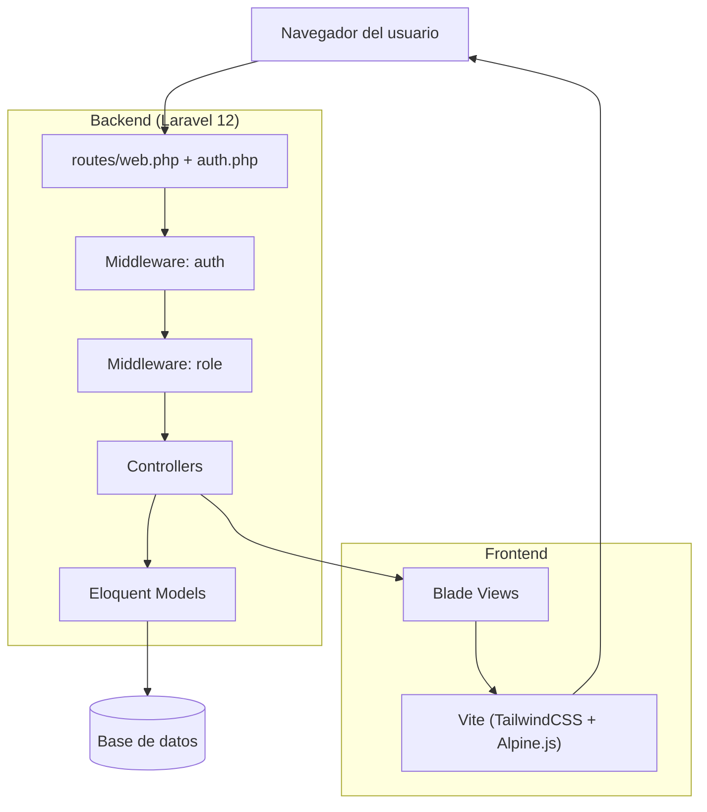
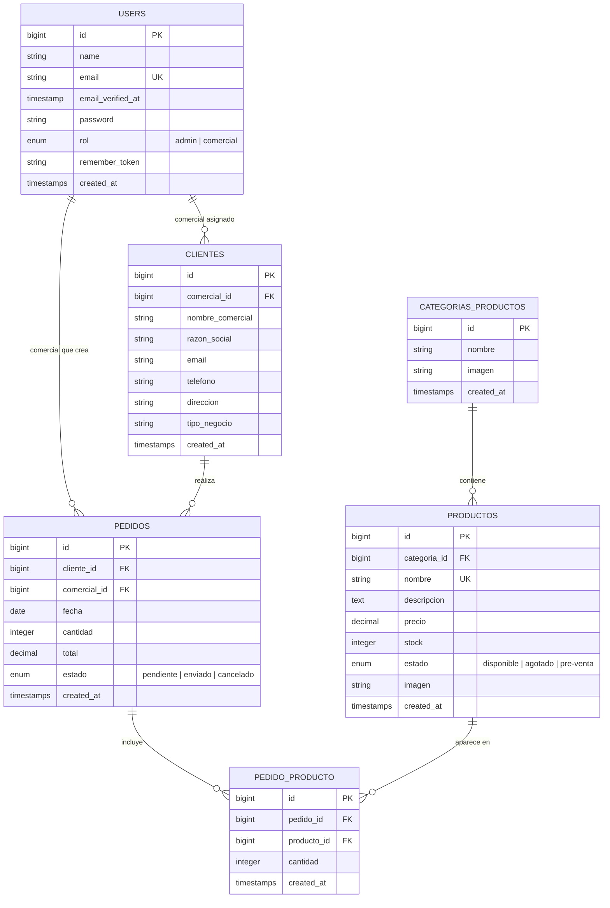
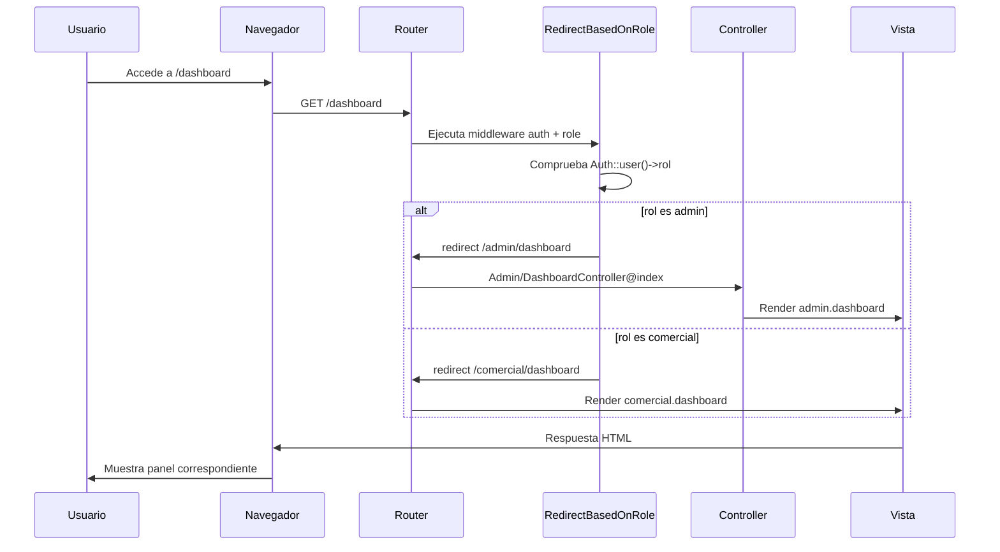
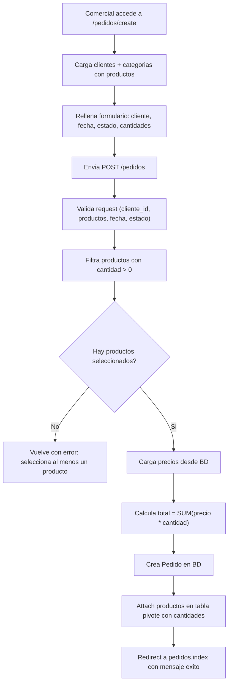
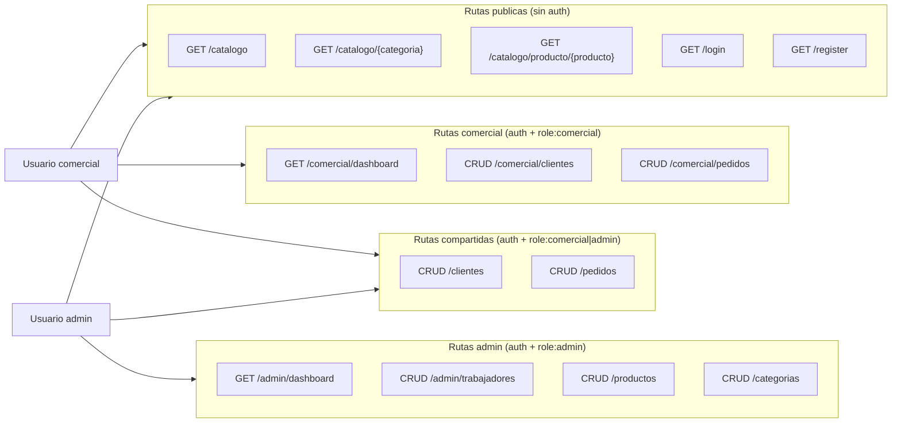
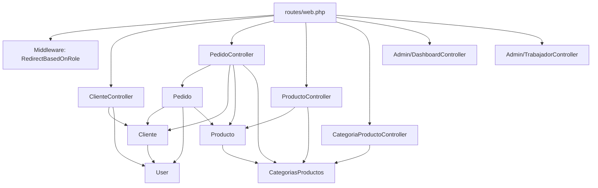

# Diagramas del sistema

Colección de diagramas Mermaid que describen la arquitectura, datos, flujos y permisos del proyecto.

## Diagrama de arquitectura general

## Modelo entidad-relación (ER)

## Flujo de autenticación y redirección por rol

## Flujo de creación de pedido

## Mapa de roles y permisos

## Diagrama de dependencias entre módulos

