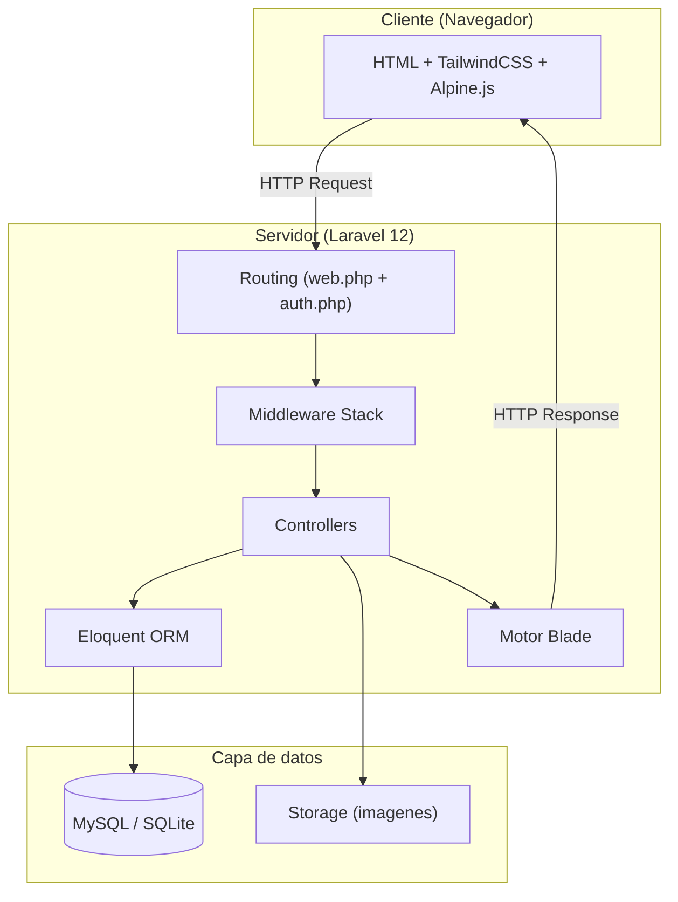

# Visión general de la arquitectura

## Patrón MVC en este proyecto

El proyecto sigue el patrón **Modelo-Vista-Controlador (MVC)** estándar de Laravel:

```
Petición HTTP → Router → Middleware → Controller → Model → Vista (Blade)
```

| Capa | Responsabilidad | Ubicación |
|------|----------------|-----------|
| **Modelo** | Acceso a datos, relaciones, reglas de negocio | `app/Models/` |
| **Vista** | Presentación HTML, formularios, layouts | `resources/views/` |
| **Controlador** | Lógica de aplicación, validación, orquestación | `app/Http/Controllers/` |

## Stack completo

### Backend

| Componente | Versión | Propósito |
|------------|---------|-----------|
| PHP | >= 8.2 | Lenguaje del servidor |
| Laravel Framework | ^12.0 | Framework MVC |
| Laravel Breeze | ^2.3 | Scaffolding de autenticación |
| Laravel Tinker | ^2.10.1 | REPL para debug |
| Laravel Sail | ^1.41 | Entorno Docker (dev) |

### Frontend

| Componente | Versión | Propósito |
|------------|---------|-----------|
| Vite | ^6.2.4 | Bundler y HMR |
| TailwindCSS | ^3.1.0 | Framework CSS utility-first |
| Alpine.js | ^3.4.2 | Interactividad ligera en el DOM |
| Axios | ^1.8.2 | Cliente HTTP para peticiones AJAX |

### Herramientas de desarrollo

| Herramienta | Propósito |
|-------------|-----------|
| Laravel Pint | Formateador de código (PSR-12) |
| Laravel Pail | Visor de logs en tiempo real |
| PHPUnit | Tests unitarios y de integración |
| Faker | Generación de datos de prueba |

## Decisiones de diseño

### ¿Por qué Breeze y no Jetstream/Fortify?

- **Breeze** proporciona un scaffolding ligero con vistas Blade + Tailwind.
- No se necesitan equipos, sesiones API ni 2FA en esta fase.
- Menor complejidad para un equipo reducido.

### ¿Por qué roles en la tabla `users` en vez de un paquete (Spatie)?

- Solo existen 2 roles (`admin`, `comercial`): no se necesita un sistema de permisos granular.
- Un campo `enum` en la tabla `users` es suficiente y más simple.
- El middleware `RedirectBasedOnRole` cubre todos los casos actuales.
- Si en el futuro se necesitan permisos más complejos, se puede migrar a `spatie/laravel-permission`.

### ¿Por qué Alpine.js y no Vue/React?

- Las vistas son renderizadas por el servidor (Blade).
- Alpine.js añade interactividad ligera (toggles, modales, filtros) sin el peso de un SPA.
- Menor curva de aprendizaje para el equipo.

### ¿Por qué tabla pivote `pedido_producto` con `cantidad`?

- Un pedido puede contener múltiples productos.
- Un producto puede estar en múltiples pedidos.
- La relación N:M requiere tabla pivote.
- El campo `cantidad` en la pivote permite saber cuántas unidades de cada producto tiene cada pedido.

## Diagrama de arquitectura



## Flujo de una petición típica

1. El usuario hace click en un enlace o envía un formulario.
2. La petición llega a `routes/web.php`, que la empareja con un controller.
3. Si la ruta tiene middleware (`auth`, `role:admin`), se ejecutan en orden.
4. El controller valida los datos, interactúa con los modelos y decide la respuesta.
5. Si es una vista, el motor Blade renderiza el HTML con los datos.
6. La respuesta HTML viaja al navegador con los assets compilados por Vite.
